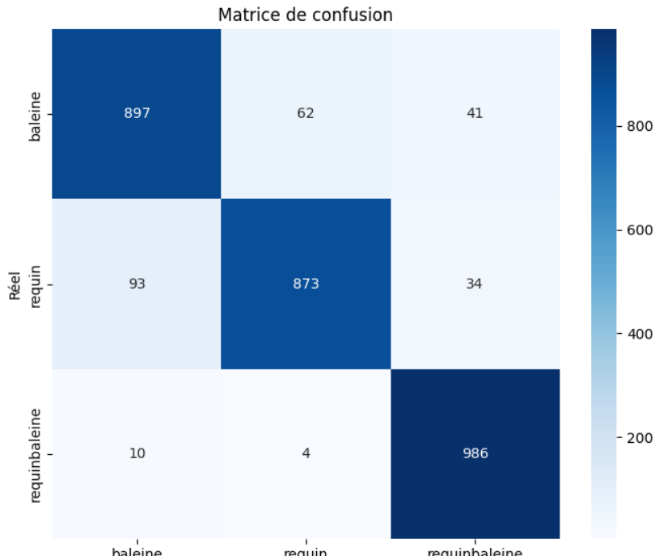
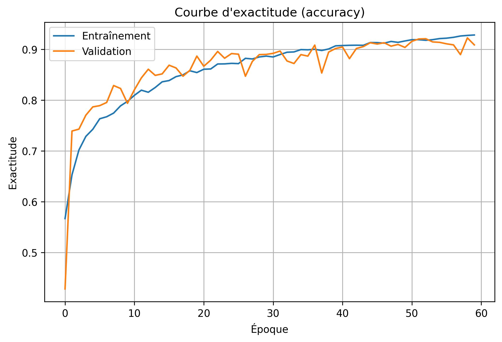

# Marine species classification with a CNN (whale / shark / whale shark)

A convolutional neural network, trained from scratch in Keras, that tells three marine species apart from RGB images. Coursework for INF7370 (Machine Learning) at UQAM, Fall 2025.

> **Result:** **91.9 % test accuracy** (2,756 / 3,000 images) and **macro-F1 0.919** on a held-out, class-balanced test set. The assignment's target was ≥ 90 %.

## Results

| Split | Images | Accuracy | Loss |
|---|---|---|---|
| Train (best epoch) | 9,600 | 93.1 % | 0.184 |
| Validation (best epoch) | 2,400 | 90.9 % | – |
| **Test (held-out)** | **3,000** | **91.9 %** | **0.235** |

Per-class scores on the test set:

| Class | Precision | Recall | F1 |
|---|---|---|---|
| Whale | 0.897 | 0.897 | 0.897 |
| Shark | 0.931 | 0.873 | 0.901 |
| Whale shark | 0.929 | **0.986** | **0.958** |
| *Macro average* | *0.919* | *0.919* | *0.919* |

<p align="center">
  
  
</p>

**What the errors tell us:** whale shark is almost never missed (14 errors out of 1,000), because its spot pattern is distinctive. Most confusions are **shark → whale** (93 cases). When I inspected the misclassified images, they were mostly partial views, unusual angles, or low-contrast water where only the silhouette is visible.

## Method

**Data.** 4,000 images per class for training (12,000 in total), split 80/20 into train and validation, plus 1,000 images per class for testing. Images are resized to 128×128. I chose 128 over the native 256 px to reduce parameters and overfitting.

**Augmentation.** Only on the training set: rotation ±30°, shifts of 15 %, shear 0.15, zoom 0.20, horizontal flip, and brightness in [0.6, 1.4]. Brightness mattered because the photos are outdoor underwater scenes.

**Architecture.** The network has about 2.1 M parameters, half of them in the first dense layer. It is built as:

```
Input 128×128×3
→ 4 × [Conv2D(3×3) → BatchNorm → ReLU → MaxPool 2×2]   filters 32, 64, 128, 256
→ Conv2D(256, 3×3) → ReLU → MaxPool
→ Flatten (4,096) → Dense 256 → Dropout 0.5 → Dense 128 → Dropout 0.4 → Softmax(3)
```

**Training.** Adam with learning rate 8e-5, batch size 32, and up to 60 epochs. Early stopping watches `val_loss` with patience 12 and restores the best weights. Training took 53 minutes on a Colab GPU.

**What moved the needle.** A first version plateaued at **85–88 %** test accuracy. Three changes pushed it past 90 %:
1. stronger augmentation (brightness and shear),
2. a lower learning rate (1e-4 and 5e-4 overfit early),
3. longer training with early stopping.

## Limitations & next steps
- There is a single train/validation split and one seed, so no variance estimate. Repeating over 3–5 seeds would give a confidence interval.
- The next baseline to try is transfer learning from a pretrained backbone (ResNet-50 or EfficientNet), which is likely to beat a from-scratch CNN on 12k images.
- An automated hyperparameter search (e.g. Keras Tuner or Optuna) could replace the manual tuning.

## Reproduce

```bash
pip install tensorflow scikit-learn matplotlib seaborn
python 1_Modele.py       # trains and saves Model.keras
python 2_Evaluation.py   # test accuracy, confusion matrix, misclassified images
```
The expected layout is `donnees/entrainement/{baleine,requin,requinbaleine}` and `donnees/test/...`. The validation folder is created automatically (20 % per class). The dataset was provided by the course and is not redistributed here.

Full report (FR): [`Jallais_Bastien_raport_TP2.pdf`](./Jallais_Bastien_raport_TP2.pdf)

**Stack:** Python · TensorFlow/Keras · scikit-learn · Matplotlib
